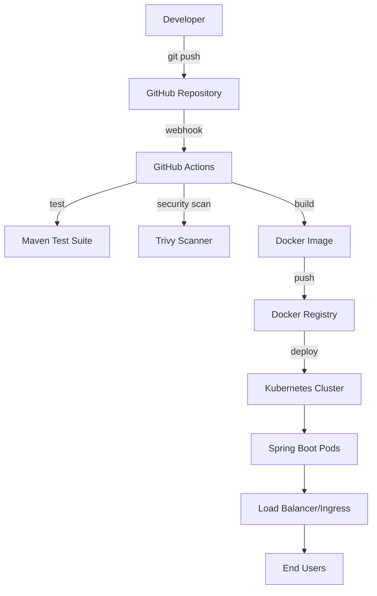

# 🚀 Spring Boot CI/CD Demo Application

[](https://github.com/karthikskumar94/spring-boot-cicd/actions/workflows/ci-cd.yml)
[](https://hub.docker.com/)
[](https://kubernetes.io/)
[](https://spring.io/projects/spring-boot)
[](https://openjdk.org/)

A comprehensive demonstration of CI/CD pipeline implementation using **Spring Boot**, **Docker**, **Kubernetes**, and **GitHub Actions**. This project showcases modern DevOps practices including containerization, orchestration, automated testing, security scanning, and deployment strategies.

## 📋 Table of Contents

- [Features](#-features)
- [Architecture](#-architecture)
- [Quick Start](#-quick-start)
- [Local Development](#-local-development)
- [Docker Usage](#-docker-usage)
- [Kubernetes Deployment](#-kubernetes-deployment)
- [CI/CD Pipeline](#-cicd-pipeline)
- [API Endpoints](#-api-endpoints)
- [Configuration](#-configuration)
- [Monitoring & Health Checks](#-monitoring--health-checks)
- [Security](#-security)
- [Contributing](#-contributing)
- [License](#-license)

## ✨ Features

### 🛠️ Application Features
- **RESTful API** with Spring Boot 3.2.0
- **Java 17** with modern language features
- **Spring Boot Actuator** for health checks and monitoring
- **Lightweight Alpine-based Docker images**
- **Multi-stage Docker builds** for optimization
- **Security best practices** with non-root containers

### 🔄 DevOps Features
- **Automated CI/CD pipeline** with GitHub Actions
- **Docker containerization** with multi-stage builds
- **Kubernetes orchestration** with production-ready manifests
- **Security scanning** with Trivy vulnerability scanner
- **Automated testing** with Maven Surefire
- **Health checks** and readiness probes
- **Resource management** with CPU/memory limits
- **Horizontal scaling** capabilities

### 🏗️ Infrastructure as Code
- **Kubernetes manifests** for deployment, service, ingress
- **Kustomization** for environment-specific configurations
- **GitHub Actions workflows** for complete automation
- **Docker Compose** support for local development

## 🏛️ Architecture



### Technology Stack
- **Backend**: Spring Boot 3.2.0, Java 17
- **Build Tool**: Apache Maven
- **Containerization**: Docker with multi-stage builds
- **Orchestration**: Kubernetes
- **CI/CD**: GitHub Actions
- **Security**: Trivy vulnerability scanning
- **Monitoring**: Spring Boot Actuator

## 🚀 Quick Start

### Prerequisites
- Java 17 or higher
- Maven 3.6+
- Docker 20.10+
- kubectl (for Kubernetes deployment)
- Git

### 1. Clone the Repository
```bash
git clone https://github.com/karthikskumar94/spring-boot-cicd.git
cd spring-boot-cicd
```

### 2. Run Locally
```bash
# Using Maven
./mvnw spring-boot:run

# Using Java
./mvnw clean package
java -jar target/spring-boot-cicd-1.0.0.jar
```

### 3. Test the Application
```bash
curl http://localhost:8080/
curl http://localhost:8080/health
curl http://localhost:8080/hello/YourName
```

## 💻 Local Development

### Running with Maven
```bash
# Clean and compile
./mvnw clean compile

# Run tests
./mvnw test

# Package application
./mvnw clean package

# Run application
./mvnw spring-boot:run
```

### Development Profile
Create `application-dev.yml` for local development:
```yaml
server:
  port: 8080
logging:
  level:
    com.example.demo: DEBUG
    org.springframework: INFO
management:
  endpoints:
    web:
      exposure:
        include: "*"
```

## 🐳 Docker Usage

### Build Docker Image
```bash
# Build the image
docker build -t spring-boot-cicd:latest .

# Run with Docker
docker run -p 8080:8080 spring-boot-cicd:latest

# Run in background
docker run -d -p 8080:8080 --name spring-app spring-boot-cicd:latest
```

### Docker Compose (Optional)
```yaml
# docker-compose.yml
version: '3.8'
services:
  app:
    build: .
    ports:
      - "8080:8080"
    environment:
      - SPRING_PROFILES_ACTIVE=docker
    healthcheck:
      test: ["CMD", "wget", "--quiet", "--tries=1", "--spider", "http://localhost:8080/actuator/health"]
      interval: 30s
      timeout: 10s
      retries: 3
```

### Docker Best Practices Implemented
- ✅ Multi-stage builds for smaller images
- ✅ Non-root user for security
- ✅ Alpine Linux for minimal attack surface
- ✅ Health checks for container orchestration
- ✅ Proper layer caching optimization

## ☸️ Kubernetes Deployment

### Deploy to Kubernetes
```bash
# Apply all Kubernetes manifests
kubectl apply -f k8s/

# Check deployment status
kubectl get pods -n spring-boot-demo

# Check service
kubectl get svc -n spring-boot-demo

# Check logs
kubectl logs -f deployment/spring-boot-app -n spring-boot-demo
```

### Using Kustomize
```bash
# Deploy with kustomization
kubectl apply -k k8s/

# Verify deployment
kubectl rollout status deployment/spring-boot-app -n spring-boot-demo
```

### Kubernetes Resources Included
- **Namespace**: Isolated environment
- **Deployment**: Application pods with 3 replicas
- **Service**: Internal load balancing
- **Service (NodePort)**: External access for testing
- **Ingress**: HTTP routing (optional)
- **Kustomization**: Environment management

### Production Considerations
- **Resource Limits**: CPU and memory constraints
- **Health Probes**: Liveness and readiness checks
- **Rolling Updates**: Zero-downtime deployments
- **Horizontal Scaling**: Automatic pod scaling
- **Security Context**: Non-root containers

## 🔄 CI/CD Pipeline

The GitHub Actions pipeline includes multiple stages:

### Pipeline Stages

#### 1. **Test Stage**
- Checkout source code
- Set up Java 17 environment
- Cache Maven dependencies
- Run unit and integration tests
- Generate test reports

#### 2. **Security Scan**
- Trivy vulnerability scanning
- SARIF report generation
- Security findings upload to GitHub

#### 3. **Build Stage** (main branch only)
- Docker image building
- Multi-platform support
- Push to Docker registry
- Image caching for performance

#### 4. **Deploy Stage** (main branch only)
- Kubernetes manifest updates
- Image tag updates with Git SHA
- Deployment to cluster (configurable)

### Setting Up CI/CD

#### Required GitHub Secrets
```bash
# Docker Hub credentials
DOCKER_USERNAME=your-dockerhub-username
DOCKER_TOKEN=your-dockerhub-token

# Optional: Kubernetes cluster credentials
KUBE_CONFIG=base64-encoded-kubeconfig
```

#### Workflow Triggers
- Push to `main` or `develop` branches
- Pull requests to `main` branch
- Manual workflow dispatch

## 🛡️ Security

### Security Measures Implemented

#### Container Security
- ✅ Multi-stage builds to minimize attack surface
- ✅ Non-root user execution
- ✅ Alpine Linux base images
- ✅ Vulnerability scanning with Trivy
- ✅ No sensitive data in images

#### Kubernetes Security
- ✅ Security contexts for pods
- ✅ Resource limits and requests
- ✅ Health checks for reliability
- ✅ Namespace isolation
- ✅ Service mesh ready

#### Application Security
- ✅ Spring Boot security defaults
- ✅ Actuator endpoint security
- ✅ Input validation
- ✅ Error handling

### Security Scanning
The pipeline includes automated security scanning:
```bash
# Manual security scan
docker run --rm -v $(pwd):/workspace aquasec/trivy fs /workspace
```

## 📡 API Endpoints

### Application Endpoints

| Method | Endpoint | Description | Example Response |
|--------|----------|-------------|------------------|
| GET | `/` | Welcome message with timestamp | `"Hello from Spring Boot CI/CD Demo! Time: 2024-01-15T10:30:00"` |
| GET | `/health` | Simple health check | `"Application is healthy!"` |
| GET | `/hello/{name}` | Personalized greeting | `"Hello John! Welcome to CI/CD Pipeline Demo!"` |

### Actuator Endpoints (Management)

| Method | Endpoint | Description |
|--------|----------|-------------|
| GET | `/actuator/health` | Detailed health information |
| GET | `/actuator/info` | Application information |
| GET | `/actuator/metrics` | Application metrics |
| GET | `/actuator/env` | Environment properties |

### Example Usage
```bash
# Test application endpoints
curl http://localhost:8080/
curl http://localhost:8080/health
curl http://localhost:8080/hello/Developer

# Test actuator endpoints
curl http://localhost:8080/actuator/health
curl http://localhost:8080/actuator/info
```

## ⚙️ Configuration

### Application Properties
```yaml
# src/main/resources/application.yml
server:
  port: 8080
  
spring:
  application:
    name: spring-boot-cicd
    
management:
  endpoints:
    web:
      exposure:
        include: health,info,metrics
  endpoint:
    health:
      show-details: when-authorized
      
logging:
  level:
    com.example.demo: INFO
```

### Environment-Specific Configurations

#### Docker Profile
```yaml
spring:
  profiles: docker
logging:
  level:
    root: WARN
    com.example.demo: INFO
```

#### Kubernetes Profile
```yaml
spring:
  profiles: kubernetes
management:
  endpoints:
    web:
      exposure:
        include: health,info,prometheus
```

## 📊 Monitoring & Health Checks

### Health Check Endpoints
- **Application Health**: `/actuator/health`
- **Custom Health**: `/health`
- **Readiness**: Kubernetes readiness probe
- **Liveness**: Kubernetes liveness probe

### Metrics Available
- **JVM Metrics**: Memory, GC, threads
- **HTTP Metrics**: Request counts, response times
- **Custom Metrics**: Business-specific metrics
- **System Metrics**: CPU, disk, network

### Monitoring Integration
```yaml
# Prometheus integration (optional)
management:
  endpoints:
    web:
      exposure:
        include: prometheus
  metrics:
    export:
      prometheus:
        enabled: true
```

## 🧪 Testing

### Test Structure
```
src/test/java/com/example/demo/
├── HelloControllerTest.java    # Controller unit tests
└── DemoApplicationTests.java   # Integration tests
```

### Running Tests
```bash
# Run all tests
./mvnw test

# Run specific test class
./mvnw test -Dtest=HelloControllerTest

# Run tests with coverage
./mvnw test jacoco:report
```

### Test Categories
- **Unit Tests**: Controller and service testing
- **Integration Tests**: End-to-end API testing
- **Container Tests**: Docker image validation
- **Security Tests**: Vulnerability scanning

## 🤝 Contributing

We welcome contributions! Please follow these guidelines:

### Development Workflow
1. **Fork** the repository
2. **Create** a feature branch (`git checkout -b feature/amazing-feature`)
3. **Commit** your changes (`git commit -m 'Add amazing feature'`)
4. **Push** to the branch (`git push origin feature/amazing-feature`)
5. **Open** a Pull Request

### Code Standards
- Follow Java coding conventions
- Write comprehensive tests
- Update documentation
- Ensure security best practices
- Add meaningful commit messages

### Pull Request Process
1. Update README.md if needed
2. Add/update tests for new features
3. Ensure CI pipeline passes
4. Request code review
5. Merge after approval

## 📈 Roadmap

### Upcoming Features
- [ ] **Database Integration** (PostgreSQL/MySQL)
- [ ] **Redis Caching** for performance
- [ ] **OpenAPI/Swagger** documentation
- [ ] **JWT Authentication** and authorization
- [ ] **Distributed Tracing** with Jaeger
- [ ] **Config Server** integration
- [ ] **Multi-environment** deployments
- [ ] **Helm Charts** for Kubernetes
- [ ] **ArgoCD** GitOps integration
- [ ] **Prometheus/Grafana** monitoring

### Infrastructure Improvements
- [ ] **Terraform** for infrastructure as code
- [ ] **AWS/GCP/Azure** cloud deployment
- [ ] **Service Mesh** (Istio) integration
- [ ] **Advanced Security** scanning
- [ ] **Performance Testing** automation
- [ ] **Blue-Green** deployments

## 📚 Additional Resources

### Documentation
- [Spring Boot Documentation](https://docs.spring.io/spring-boot/docs/current/reference/htmlsingle/)
- [Docker Best Practices](https://docs.docker.com/develop/dev-best-practices/)
- [Kubernetes Documentation](https://kubernetes.io/docs/)
- [GitHub Actions Documentation](https://docs.github.com/en/actions)

### Tutorials
- [Spring Boot Testing Guide](https://spring.io/guides/gs/testing-web/)
- [Docker Multi-stage Builds](https://docs.docker.com/develop/dev-best-practices/#use-multi-stage-builds)
- [Kubernetes Deployments](https://kubernetes.io/docs/concepts/workloads/controllers/deployment/)

## 📝 License

This project is licensed under the **MIT License** - see the [LICENSE](LICENSE) file for details.

## 👨‍💻 Author

**Karthik Kumar** - [karthikskumar94](https://github.com/karthikskumar94)

---

## ⭐ Star This Repository

If this project helped you learn about CI/CD pipelines, please consider giving it a star! ⭐

## 🙏 Acknowledgments

- Spring Boot team for the amazing framework
- Docker community for containerization best practices
- Kubernetes community for orchestration excellence
- GitHub for powerful CI/CD capabilities

---

**Happy Coding! 🚀**
