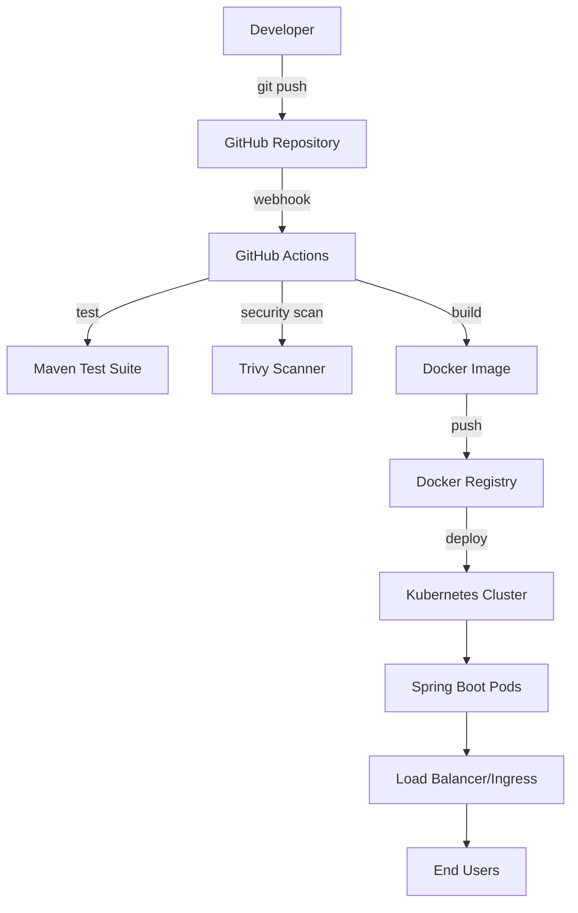

# 🚀 ms-ticket

[](https://hub.docker.com/)
[](https://kubernetes.io/)
[](https://spring.io/projects/spring-boot)
[](https://openjdk.org/)

`ms-ticket` is the ticket microservice for a cinema platform. It uses **Spring Boot**, **PostgreSQL**, **Flyway**, **Docker**, **Kubernetes**, and **GitHub Actions** to provide a production-oriented microservice baseline. It now supports **Keycloak OIDC authentication** (OAuth2, token revocation, user roles).

## 📋 Table of Contents

- [Features](#-features)
- [Architecture](#-architecture)
- [Quick Start](#-quick-start)
- [Local Development](#-local-development)
- [Docker Usage](#-docker-usage)
- [Kubernetes Deployment](#-kubernetes-deployment)
- [CI/CD Pipeline](#-cicd-pipeline)
- [API Endpoints](#-api-endpoints)
- [Configuration](#-configuration)
- [Monitoring & Health Checks](#-monitoring--health-checks)
- [Security](#-security)
- [Contributing](#-contributing)
- [License](#-license)

## ✨ Features

### 🛠️ Application Features
- **RESTful API** with Spring Boot 3.2.0
- **PostgreSQL persistence** with Spring Data JPA
- **Flyway migrations** for schema versioning
- **Java 17** with modern language features
- **Spring Boot Actuator** for health checks and monitoring
- **Lightweight Alpine-based Docker images**
- **Multi-stage Docker builds** for optimization
- **Security best practices** with non-root containers
- **Keycloak OIDC authentication** (OAuth2, token revocation, user roles)

### 🔄 DevOps Features
- **Automated CI/CD pipeline** with GitHub Actions
- **Docker containerization** with multi-stage builds
- **Kubernetes orchestration** with production-ready manifests
- **Security scanning** with Trivy vulnerability scanner
- **Automated testing** with Maven Surefire
- **Health checks** and readiness probes
- **Resource management** with CPU/memory limits
- **Horizontal scaling** capabilities

### 🏗️ Infrastructure as Code
- **Kubernetes manifests** for deployment, service, ingress
- **Kustomization** for environment-specific configurations
- **GitHub Actions workflows** for complete automation
- **Docker Compose** support for local development

## 🏛️ Architecture



### Technology Stack
- **Backend**: Spring Boot 3.2.0, Java 17, Spring Data JPA
- **Database**: PostgreSQL 16
- **Database Migrations**: Flyway
- **Build Tool**: Apache Maven
- **Containerization**: Docker with multi-stage builds
- **Orchestration**: Kubernetes
- **CI/CD**: GitHub Actions
- **Security**: Trivy vulnerability scanning
- **Monitoring**: Spring Boot Actuator

## 🚀 Quick Start

### Prerequisites
- Java 17 or higher
- Maven 3.6+
- Docker 20.10+
- kubectl 1.28+ with Kustomize support
- kind, Minikube, or Docker Desktop Kubernetes for local clusters
- Git

### 1. Clone the Repository
```bash
git clone <your-repository-url>
cd ticket
```

### 2. Run Locally
```bash
# Using Maven with the local Spring profile
SPRING_PROFILES_ACTIVE=local ./mvnw spring-boot:run

# Using Java
./mvnw clean package
java -jar target/ms-ticket-1.0.0.jar --spring.profiles.active=local
```

### 3. Test the Application
```bash
curl http://localhost:8080/
curl http://localhost:8080/health
curl http://localhost:8080/hello/YourName
```

## 💻 Local Development

### Running with Maven
```bash
# Clean and compile
./mvnw clean compile

# Run tests
./mvnw test

# Package application
./mvnw clean package

# Run application with the local profile
SPRING_PROFILES_ACTIVE=local ./mvnw spring-boot:run
```

### Spring Profiles
The project now includes dedicated profiles for each environment:

- `application-local.yml`: more verbose logs and all actuator endpoints exposed for local development
- `application-homolog.yml`: settings for validation environments
- `application-prod.yml`: production-safe actuator visibility

Switch profiles with `SPRING_PROFILES_ACTIVE=local|homolog|prod`.

## 🐳 Docker Usage

### Build Docker Image

```bash
# Build the image
docker build -t ms-ticket:latest .

# Run with Docker
docker run -p 8080:8080 ms-ticket:latest

# Run in background
docker run -d -p 8080:8080 --name ms-ticket ms-ticket:latest
```

### Docker Compose with Local Database

There is now a ready-to-use local Compose file at `docker-compose.local.yml`.

1. Copy `.env.docker.example` to `.env` if you want to customize ports, database name, or credentials.
2. Start the application and PostgreSQL together.

```bash
docker compose -f docker-compose.local.yml up -d --build
```

Useful commands:

```bash
# Follow logs
docker compose -f docker-compose.local.yml logs -f

# Stop everything
docker compose -f docker-compose.local.yml down

# Stop everything and remove the database volume
docker compose -f docker-compose.local.yml down -v
```

Default local endpoints:

- Application: `http://localhost:8080`
- PostgreSQL: `localhost:5432`
- Database: `ms_ticket`
- User: `ticket`

Default local authentication setup:

- Admin user: `admin` / `admin12345`
- Box office user: `boxoffice` / `boxoffice12345`
- JWT secret: configured by `JWT_SECRET` in `.env`

The application now starts with PostgreSQL, JPA, and Flyway enabled by default. The local Compose file is enough to run the API and the database together.

### Docker Best Practices Implemented

- ✅ Multi-stage builds for smaller images
- ✅ Non-root user for security
- ✅ `.dockerignore` to reduce build context and speed up image builds
- ✅ Container defaults for `SPRING_PROFILES_ACTIVE` and `JAVA_TOOL_OPTIONS`
- ✅ Alpine Linux for minimal attack surface
- ✅ Health checks for container orchestration
- ✅ Proper layer caching optimization

## ☸️ Kubernetes Deployment

### Kubernetes Layout
```text
k8s/
  base/
    deployment.yaml
    service.yaml
    kustomization.yaml
  overlays/
    local/
    homolog/
    prod/
```

- `base`: shared manifests for every environment
- `overlays/local`: single replica, `imagePullPolicy: Never`, NodePort, and local ingress
- `overlays/homolog`: validation environment with dedicated namespace and registry image
- `overlays/prod`: production defaults with higher resources and replica count

### Deploy Locally with kind
```bash
# Create a local cluster once
kind create cluster --name ms-ticket

# Build the application image with the tag expected by the local overlay
docker build -t ms-ticket:local .

# Load the image into the kind cluster
kind load docker-image ms-ticket:local --name ms-ticket

# Deploy the local overlay
kubectl apply -k k8s/overlays/local

# Wait for rollout
kubectl rollout status deployment/ms-ticket -n ms-ticket-local

# Access the application
kubectl get svc -n ms-ticket-local
```

You can access the app locally with either of these options:

- NodePort: `http://localhost:30080/`
- Ingress: `http://ms-ticket.localtest.me/`

### Local Alternative with Minikube
```bash
# Start Minikube
minikube start

# Build and load the image
docker build -t ms-ticket:local .
minikube image load ms-ticket:local

# Deploy the local overlay
kubectl apply -k k8s/overlays/local
```

### Deploy to Homolog and Production
Update the registry name defined in these files before deploying:

- `k8s/overlays/homolog/kustomization.yaml`
- `k8s/overlays/prod/kustomization.yaml`

Then build, push, and apply the desired overlay:

```bash
# Example image
docker build -t ghcr.io/your-org/ms-ticket:1.0.0 .
docker push ghcr.io/your-org/ms-ticket:1.0.0

# Update the overlay tag or let CI do it for you
kubectl apply -k k8s/overlays/homolog
kubectl apply -k k8s/overlays/prod
```

Recommended CI/CD flow:

1. Run `mvn test`
2. Build and push an immutable image tag such as the Git SHA
3. Update the target overlay image tag
4. Run `kubectl apply -k` for `homolog` or `prod`
5. Wait for `kubectl rollout status`

### Production Considerations
- **Container Registry**: use GHCR, Docker Hub, ACR, ECR, or another accessible registry
- **Ingress Controller**: install NGINX Ingress or Traefik in the cluster
- **TLS**: use cert-manager for HTTPS certificates
- **Secrets**: keep credentials in Kubernetes Secrets or an external secret manager
- **Observability**: collect metrics, logs, and alerts before going live
- **Autoscaling**: add HPA after defining realistic CPU and memory requests

## 🔄 CI/CD Pipeline

The GitHub Actions pipeline includes multiple stages:

### Pipeline Stages

#### 1. **Test Stage**
- Checkout source code
- Set up Java 17 environment
- Cache Maven dependencies
- Run unit and integration tests
- Generate test reports

#### 2. **Security Scan**
- Trivy vulnerability scanning
- SARIF report generation
- Security findings upload to GitHub

#### 3. **Build Stage** (main branch only)
- Docker image building
- Multi-platform support
- Push to Docker registry
- Image caching for performance

#### 4. **Deploy Stage** (main branch only)
- Kubernetes manifest updates
- Image tag updates with Git SHA
- Deployment to cluster (configurable)

### Setting Up CI/CD

#### Required GitHub Secrets
```bash
# Docker Hub credentials
DOCKER_USERNAME=your-dockerhub-username
DOCKER_TOKEN=your-dockerhub-token

# Optional: Kubernetes cluster credentials
KUBE_CONFIG=base64-encoded-kubeconfig
```

#### Workflow Triggers
- Push to `main` or `develop` branches
- Pull requests to `main` branch
- Manual workflow dispatch

## 🛡️ Security

### Security Measures Implemented

#### Container Security
- ✅ Multi-stage builds to minimize attack surface
- ✅ Non-root user execution
- ✅ Alpine Linux base images
- ✅ Vulnerability scanning with Trivy
- ✅ No sensitive data in images

#### Kubernetes Security
- ✅ Security contexts for pods
- ✅ Resource limits and requests
- ✅ Health checks for reliability
- ✅ Namespace isolation
- ✅ Service mesh ready

#### Application Security
- ✅ Spring Boot security defaults
- ✅ JWT bearer token authentication
- ✅ Role-based authorization for ticket endpoints
- ✅ Actuator endpoint security
- ✅ Input validation
- ✅ Error handling

### Security Scanning
The pipeline includes automated security scanning:
```bash
# Manual security scan
docker run --rm -v $(pwd):/workspace aquasec/trivy fs /workspace
```

## 📡 API Endpoints

### Application Endpoints

| Method | Endpoint | Description | Example Response |
|--------|----------|-------------|------------------|
| GET | `/` | Service status with timestamp | `"ms-ticket is running. Time: 2026-04-18T19:30:00"` |
| GET | `/health` | Simple health check | `"ms-ticket is healthy!"` |
| GET | `/hello/{name}` | Simple greeting endpoint | `"Hello John! Welcome to ms-ticket."` |
| POST | `/api/auth/register` | Create a customer user | JSON object |
| POST | `/api/auth/login` | Authenticate and receive JWT | JSON object |
| GET | `/api/auth/me` | Return the authenticated user profile | JSON object |
| GET | `/api/tickets` | List sold or reserved tickets | JSON array |
| GET | `/api/tickets/{id}` | Fetch one ticket by id | JSON object |
| POST | `/api/tickets` | Create a new ticket | JSON object |

### Actuator Endpoints (Management)

| Method | Endpoint | Description |
|--------|----------|-------------|
| GET | `/actuator/health` | Detailed health information |
| GET | `/actuator/info` | Application information |
| GET | `/actuator/metrics` | Application metrics |
| GET | `/actuator/env` | Environment properties |

### Example Usage
```bash
# Test application endpoints
curl http://localhost:8080/
curl http://localhost:8080/health
curl http://localhost:8080/hello/Developer

# Get a JWT token for a bootstrap box office user
curl -X POST http://localhost:8080/api/auth/login \
  -H "Content-Type: application/json" \
  -d '{
    "username":"boxoffice",
    "password":"boxoffice12345"
  }'

# Create a ticket with the JWT from the login response
curl -X POST http://localhost:8080/api/tickets \
  -H "Content-Type: application/json" \
  -H "Authorization: Bearer <token>" \
  -d '{
    "screeningId":"screening-001",
    "movieName":"Interstellar",
    "sessionTime":"2030-04-18T20:00:00Z",
    "seatNumber":"A10",
    "customerName":"Kaue",
    "price":32.50,
    "status":"PURCHASED"
  }'

# Test actuator endpoints
curl http://localhost:8080/actuator/health
curl http://localhost:8080/actuator/info
```

## ⚙️ Configuration

### Application Properties
```yaml
# src/main/resources/application.yml
server:
  port: 8080
  
spring:
  application:
    name: ms-ticket
  datasource:
    url: jdbc:postgresql://${DB_HOST:localhost}:${DB_PORT:5432}/${DB_NAME:ms_ticket}
    username: ${DB_USERNAME:ticket}
    
management:
  endpoints:
    web:
      exposure:
        include: health,info,metrics
  endpoint:
    health:
      show-details: when-authorized
      
logging:
  level:
    com.example.demo: INFO
```

### Environment-Specific Configurations

#### Local Profile
```yaml
spring:
  jpa:
    show-sql: true
      jwt:
        issuer: ms-ticket
        expiration-minutes: 120
        secret: ${JWT_SECRET:replace-me}
      bootstrap:
        enabled: ${BOOTSTRAP_USERS_ENABLED:false}
        admin-username: ${ADMIN_USERNAME:admin}
        box-office-username: ${BOX_OFFICE_USERNAME:boxoffice}

  ### Authorization Rules

  - Public: `/`, `/health`, `/hello/**`, `/api/auth/login`, `/api/auth/register`
  - Authenticated: `/api/auth/me`
  - Roles `ADMIN` or `BOX_OFFICE`: `/api/tickets/**`

  ### Added Libraries

  - `spring-boot-starter-security`: base authentication and authorization support
  - `spring-boot-starter-oauth2-resource-server`: bearer token and JWT resource server support
  - `spring-security-test`: security-aware controller tests
  - `spring-boot-starter-data-jpa`: persistence layer
  - `postgresql`: JDBC driver for PostgreSQL
  - `flyway-core`: database versioning and migration execution

logging:
  level:
    com.example.demo: DEBUG
```

#### Production Profile
```yaml
spring:
  datasource:
    hikari:
      maximum-pool-size: 15
```

## 📊 Monitoring & Health Checks

### Health Check Endpoints
- **Application Health**: `/actuator/health`
- **Custom Health**: `/health`
- **Readiness**: Kubernetes readiness probe
- **Liveness**: Kubernetes liveness probe

### Metrics Available
- **JVM Metrics**: Memory, GC, threads
- **HTTP Metrics**: Request counts, response times
- **Custom Metrics**: Business-specific metrics
- **System Metrics**: CPU, disk, network

### Monitoring Integration
```yaml
# Prometheus integration (optional)
management:
  endpoints:
    web:
      exposure:
        include: prometheus
  metrics:
    export:
      prometheus:
        enabled: true
```

## 🧪 Testing

### Test Structure
```
src/test/java/com/example/demo/
├── StatusControllerTest.java   # Status endpoint tests
└── ticket/TicketControllerTest.java
```

### Running Tests
```bash
# Run all tests
./mvnw test

# Run specific test class
./mvnw test -Dtest=StatusControllerTest

# Run tests with coverage
./mvnw test jacoco:report
```

### Test Categories
- **Unit Tests**: Controller and service testing
- **Integration Tests**: End-to-end API testing
- **Container Tests**: Docker image validation
- **Security Tests**: Vulnerability scanning

## 🤝 Contributing

We welcome contributions! Please follow these guidelines:

### Development Workflow
1. **Fork** the repository
2. **Create** a feature branch (`git checkout -b feature/amazing-feature`)
3. **Commit** your changes (`git commit -m 'Add amazing feature'`)
4. **Push** to the branch (`git push origin feature/amazing-feature`)
5. **Open** a Pull Request

### Code Standards
- Follow Java coding conventions
- Write comprehensive tests
- Update documentation
- Ensure security best practices
- Add meaningful commit messages

### Pull Request Process
1. Update README.md if needed
2. Add/update tests for new features
3. Ensure CI pipeline passes
4. Request code review
5. Merge after approval

## 📈 Roadmap

### Upcoming Features
- [ ] **Database Integration** (PostgreSQL/MySQL)
- [ ] **Redis Caching** for performance
- [ ] **OpenAPI/Swagger** documentation
- [ ] **JWT Authentication** and authorization
- [ ] **Distributed Tracing** with Jaeger
- [ ] **Config Server** integration
- [ ] **Multi-environment** deployments
- [ ] **Helm Charts** for Kubernetes
- [ ] **ArgoCD** GitOps integration
- [ ] **Prometheus/Grafana** monitoring

### Infrastructure Improvements
- [ ] **Terraform** for infrastructure as code
- [ ] **AWS/GCP/Azure** cloud deployment
- [ ] **Service Mesh** (Istio) integration
- [ ] **Advanced Security** scanning
- [ ] **Performance Testing** automation
- [ ] **Blue-Green** deployments

## 📚 Additional Resources

### Documentation
- [Spring Boot Documentation](https://docs.spring.io/spring-boot/docs/current/reference/htmlsingle/)
- [Docker Best Practices](https://docs.docker.com/develop/dev-best-practices/)
- [Kubernetes Documentation](https://kubernetes.io/docs/)
- [GitHub Actions Documentation](https://docs.github.com/en/actions)

### Tutorials
- [Spring Boot Testing Guide](https://spring.io/guides/gs/testing-web/)
- [Docker Multi-stage Builds](https://docs.docker.com/develop/dev-best-practices/#use-multi-stage-builds)
- [Kubernetes Deployments](https://kubernetes.io/docs/concepts/workloads/controllers/deployment/)

## 📝 License

This project is licensed under the **MIT License** - see the [LICENSE](LICENSE) file for details.

## ⭐ Star This Repository

If this project helped you learn about CI/CD pipelines, please consider giving it a star! ⭐

## 🙏 Acknowledgments

- Spring Boot team for the amazing framework
- Docker community for containerization best practices
- Kubernetes community for orchestration excellence
- GitHub for powerful CI/CD capabilities

---

**Happy Coding! 🚀**
